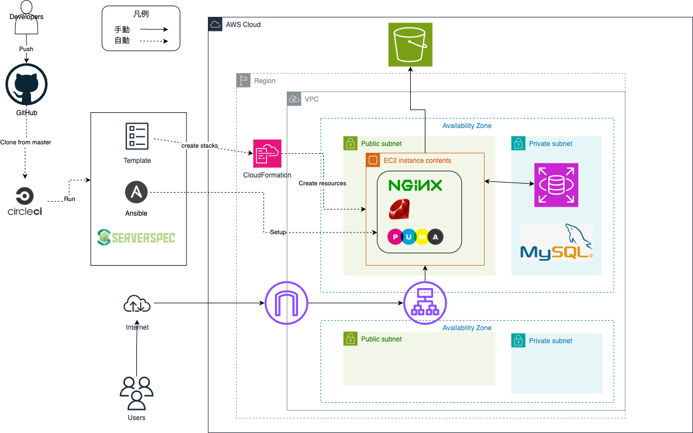

# CI/CDを用いたRailsアプリケーションのインフラストラクチャ自動構築

## 概要  

1. CRUD 処理が出来るRailsアプリケーションを稼働できるインフラストラクチャを構成
1. CI/CDツールを使い、AWSリソース構築からアプリケーションに実行環境構築、デプロイまで自動化
1. Severspecで構築したサーバーに対して自動テスト

- ソースコードは別リポジトリに格納  

### 構成図

---

### 学習記録

オンラインスクールRaiseTechで学習した講座概要と提出課題については以下の通り  

| 講座 | 概要 | 提出課題 | 補足 |
|:----|:----|:----|:----|
| 第1回 | AWSアカウント作成 IAM設定 Cloud9の作成 | 該当なし | Discord上に提出のため反映無し |
| 第2回 | Gitの基礎学習 GitHubアカウントの作成 Pull Requestの練習 | [lecture02.md](lecture02.md) | Cloud9のターミナルで実施 |
| 第3回 | Webアプリケーションについて Cloud9でサンプルアプリケーション(Rails)のデプロイ | [lecture03.md](lecture3.md) | - |
| 第4回 | VPC, EC2, RDSの手動構築 EC2からRDSへの接続確認 | [lecture04.md](lecture04.md) | - |
| 第5回 | 手動でRailsアプリケーション環境構築 ALB, S3の追加 AWS構成図の作成 | [lecture05.md](lecture05.md) | - |
| 第6回 | AWSでの証跡、ログ AWSでの監視、通知 AWSでのコスト管理 | [lecture06.md](lecture06.md) | - |
| 第7回 | システムにおけるセキュリティの基礎 AWSでのセキュリティ対策 | 該当なし | - |
| 第8回 | 第5回課題のライブコーディング | 該当なし | - |
| 第9回 | 第5回課題のライブコーディング | 該当なし | - |
| 第10回 | Infrastructure as Codeから成るインフラ自動化 CloudFormationの利用 | [lecture10.md](lecture10.md) | 第5回で構築した環境のコード化 以降、IDEはVSCodeを使用 |
| 第11回 | インフラのテスト Serverspecを用いた自動テスト | [lecture11.md](lecture11.md) | - |
| 第12回 | DevOps CI/CDツールについて CircleCIについて | [lecture12.md](lecture12.md) | - |
| 第13回 | Ansibleの導入 CircleCIとの併用 | [lecture13.md](lecture13.md) | - |
| 第14回 | 第13回課題のライブコーディング  READMEの整備| 該当なし | - |
| 第15回 | 第13回課題のライブコーディング | 該当なし | - |
| 第16回 | 現場へ出ていくにあたって必要な知識と技術、立ち振る舞いについて | 該当なし | 最終回 |
