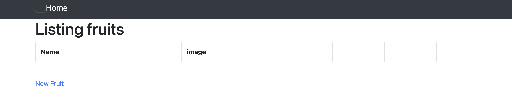
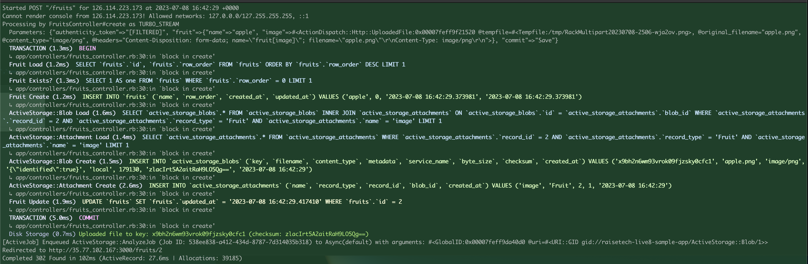
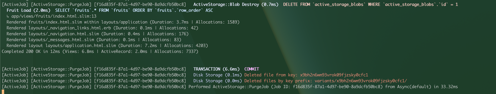
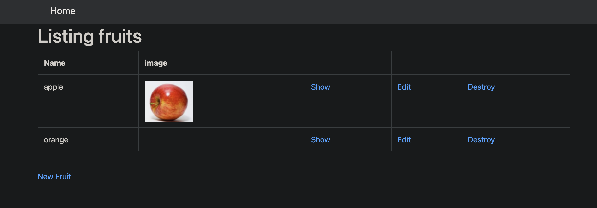
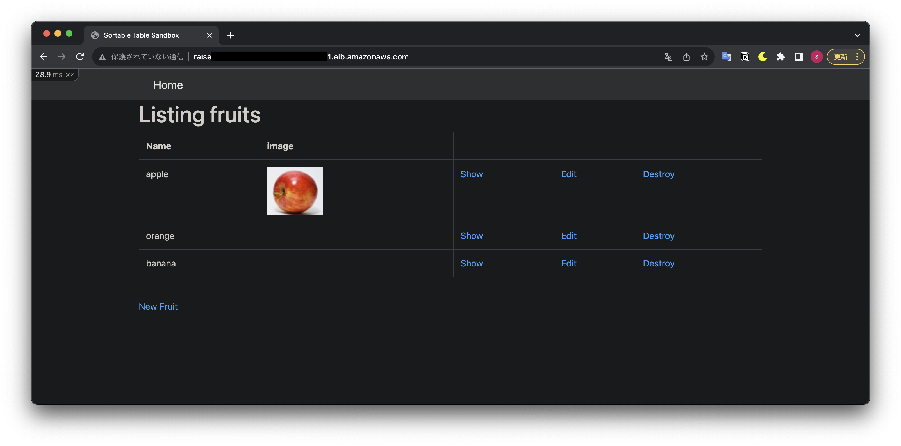
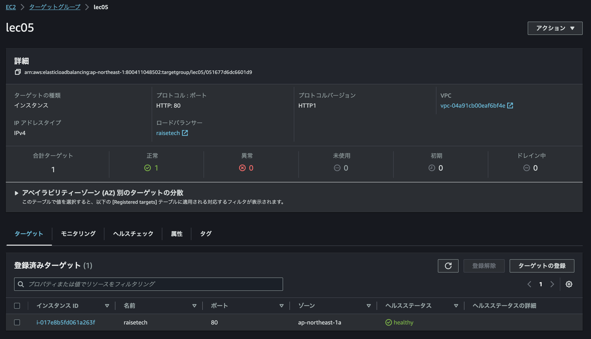
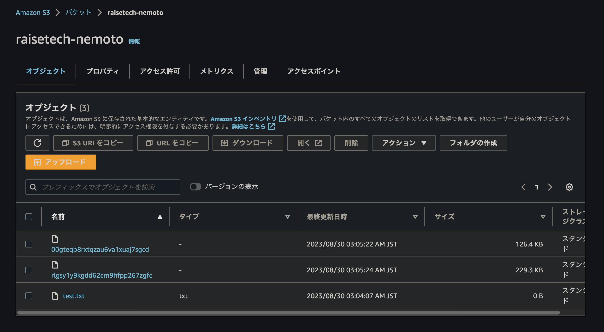
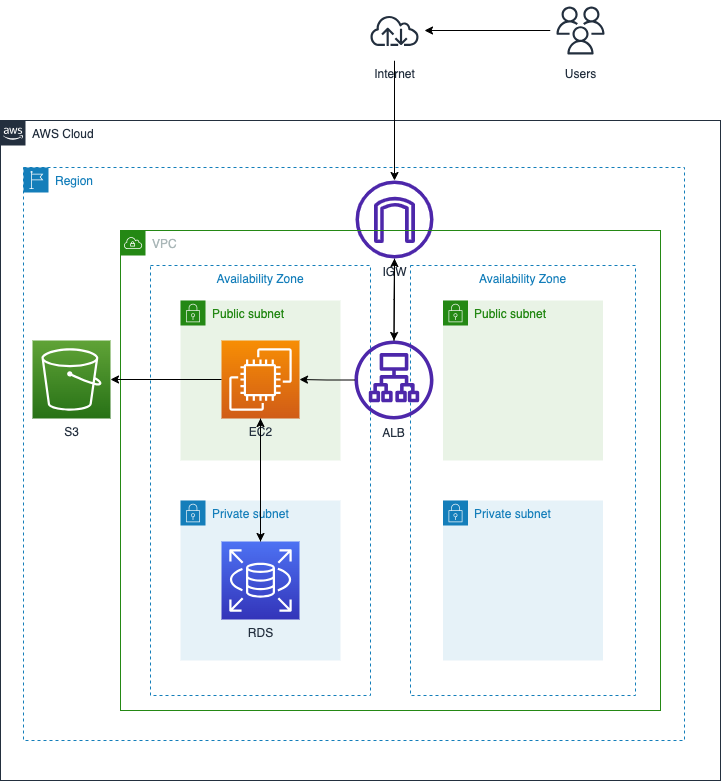

# 第5回課題
  ### サンプルアプリをEC２上にクローンしてデプロイ

####  必要なものをアプリのREAD.MEを見ながらインストール
1. gitをインストール　`sudo yum install git`
2. リポジトリをクローン　`git clone <リポジトリのURL>`
3. rubyをインストール
  - 必要なパッケージをインストール  
  ```bash 
  sudo yum update
sudo yum install gcc openssl-devel libyaml-devel libffi-devel readline-devel zlib-devel gdbm-devel ncurses-devel
```  
   - rubyのバージョン管理ツールrbenvをインストールする
  ```bash
  git clone https://github.com/rbenv/rbenv.git ~/.rbenv
echo 'export PATH="$HOME/.rbenv/bin:$PATH"' >> ~/.bashrc
echo 'eval "$(rbenv init -)"' >> ~/.bashrc
exec $SHELL
```
  - rubyをインストール(アプリケーションのrubyバージョンを確認する)
  ```bash
rbenv install 3.1.2
```
- インストールしたrubyをグローバルに設定
```bash
rbenv global 3.1.2
```
4.  bundlerのインストール
```bash
gem install bundler
```
  - sassc-rails　のインストールのことでエラーになって進まなくなった.下記コマンドで解消
     ```bash
    sudo yum groupinstall -y "Development Tools"
    ```


1.  rails のインストール
```bash
gem install rails
```
1. nodejsのインストール 
    -  nvm（nodejsのバージョン管理ツール）をインストール
    ```bash
    curl -o- https://raw.githubusercontent.com/nvm-sh/nvm/v0.38.0/install.sh | bash
    ```
   - nodejsをバージョン指定してインストール(今回は17.9.1の指定)
   ```bash
   nvm install v17.9.1
   ```
2. yarnのインストール（1.22.19)
   ```bash
   npm install -g yarn@1.22.19
   ```
3. mysqlのインストール  
  - MariaDBを削除してmySQL8.0をインストール
```bash
curl -fsSL https://raw.githubusercontent.com/MasatoshiMizumoto/raisetech_documents/main/aws/scripts/mysql_amazon_linux_2.sh | sh
```
1. databse.yml.sampleを編集
     - user名,password,host[RDSのエンドポイント]を変更
     - ymlファイルの名前を編集  
```sudo vi database.yml.sample``` の後に  
```:wq database.yml``` でファイル名変更して終了  
1.  データベースの作成  
  `bin/rails db:create`   
  `bin/rails db:migrate`  

## 組み込みサーバー（puma）での動作確認　　
- EC2インバウンドルールーでポート3000を開放
   - セキュリティグループで「ルールの追加」
   - カスタムTCP でポートを3000 ソースをマイIP
   - 「ルールを保存」（反映までちょっとかかる）
- railsを起動  
  `rails s -b 0.0.0.0` もしくは  
  `bin/dev`  
- ブラウザに　`http://<サーバーのIP>:3000`
- <サーバーのIP>はEC2 パブリック IPv4 アドレス
     - エラー発生  
     ```bash
     Sprockets::Rails::Helper::AssetNotFound in Fruits#index
     ```
     ### →アセットのプリコンパイルで解決  
      `rake assets:precompile`  


  

データ作成   
   
データ削除
  

## Nginx（webサーバー）とunicorn(APサーバー)に分けてデプロイ  
  ### まずはNginxとpumaでデプロイできるか確認
  - Nginxをインストール  
    ```bash
    sudo amazon-linux-extras install nginx1
    ```
  - Nginxを起動  
    ```bash
    sudo systemctl start nginx
    ```
  - 自動起動の有効化
    ```bash
    sudo systemctl enable nginx
    ```
  - セキュリティグループの設定  
    インバウンドルールを ルールタイプHTTP 送信元：0.0.0.0/0 にしてポート80を許可する  

  #### → Welcome to nginx!   
  - Nginxの設定ファイルを作成  
    - 設定ファイルを作成 (ここではrails.conf とした)
      ```bash
      sudo vim /etc/nginx/conf.d/rails.conf
      ```
### unicornの設定（Pumaからunicornへ）
- Gemfileを編集して、Pumaの行をコメントアウト  
```ruby
# gem 'puma'
```
- config/unicorn.rbファイルを作成して、Unicornの設定を記述
```ruby
#Unicornのワーカープロセス数
worker_processes Integer(ENV["WEB_CONCURRENCY"] || 3)
timeout 15

#アプリケーションを事前にロードしてダウンタイムを最小限に抑える設定
preload_app true

# Unicornのソケットファイルのパス(NginxとUnicornを連携させるためには、Unixドメインソケットを使用)
listen '/home/ec2-user/raisetech-live8-sample-app/tmp/unicorn.sock'
# PIDファイルの保存先
pid    '/home/ec2-user/raisetech-live8-sample-app/tmp/unicorn.pid'

# プロセスをフォークする前に、アプリケーションを立ち上げるためのコードを記述
before_fork do |server, worker|
  Signal.trap 'TERM' do
    puts 'Unicorn master intercepting TERM and sending myself QUIT instead'
    Process.kill 'QUIT', Process.pid
  end

  defined?(ActiveRecord::Base) and
    ActiveRecord::Base.connection.disconnect!
end

# プロセスをフォークした後に、アプリケーションを再起動するためのコードを記述
after_fork do |server, worker|
  Signal.trap 'TERM' do
    puts 'Unicorn worker intercepting TERM and doing nothing. Wait for master to send QUIT'
  end

  defined?(ActiveRecord::Base) and
    ActiveRecord::Base.establish_connection
end

# ログファイルの保存先
stderr_path File.expand_path('log/unicorn.log', ENV['RAILS_ROOT'])
```
- Unicornを起動
```bash
bundle exec unicorn -c config/unicorn.rb -d
```
#### → 403 forbidden　で表示されない！（途中で502 Badwayになった）

###  Nginxのパーミッションエラーでハマる
  - パーミション変更
     - エラーログに記載されていたindex.html に権限を付与
     - nginx/config のuserを nginxから ec2-user に修正
  ### →　エラー解消！　表示された




---  
ハマった時に使ったコマンド  
- nginxの再起動  
sudo systemctl restart nginx  
- nginxの起動とログ  
systemctl status nginx.service  
journalctl -xe  
- unicornの起動（開発環境でバックグラウンド起動）
bundle exec unicorn -c config/unicorn.rb -E development -D  
- 起動確認  (プロセスID確認)   
ps aux | grep unicorn  
ps aux | grep nginx
- unicorn停止  
kill -QUIT [プロセスID]  
- ログ確認  
unicorn: vi log/unicorn.log  
Nginx: sudo vi /var/log/nginx/error.log  
- 画像が表示されない  
$ sudo yum -y install ImageMagick  
$ convert -version
---

## ELB(ALB)経由でEC2へ接続  
AWS Management Consoleにログインし、ALBを作成  
セキュリティグループとターゲットグループの作成  
- ターゲットグループ  
  - タイプ：インスタンス
  - プロトコル：http:80  
  - VPC：インスタンスが使ってるVPC
- セキュリティグループ  
  - インバウンドルール　http　ポート80を解放
- ターゲットにインスタンスをアタッチ
- EC２のインバウンドルールにALBのセキュリティグループをソースとしたhttp:80のルールを追加

＜アプリ側の設定＞
- host名をDNS名に修正する  
  config/environments/development.rb 内の下記のconfigure do の後に記述
  
```ruby
Rails.application.configure do
  # ... 他の設定 ...

  # ALBのDNS名を追加
  config.hosts << "DNS名"
  ```  
 ### →接続！  

    

  
---
ハマったところ
- ホワイトリストにホスト名を追加してもBlocked hostのエラーのままで試行錯誤  
- 結局、unicornの再起動でエラー解消した  
- rail の再起動をしていたけど、killコマンドでunicornを再起動することが必要だった  
---  
## S3を追加  
#### 画像の保存先をS3に設定する  
1. AWSのコンソールからバケットを作成  
2. 作成したバケットにだけアクセスできるIAMポリシーを作成  
   
    ```json
    {
      "Version": "2012-10-17",
      "Statement": [
          {
              "Effect": "Allow",
              "Action": "s3:*",
              "Resource": [
                  "arn:aws:s3:::raisetech-nemoto/*"
              ]
          }
      ]
    }
     ```  

3. S3用のIAMユーザーを作成
   - ２で作ったポリシーをアタッチする  
   - アクセスキーとシークレットアクセスキーを作成
4. config/environments/development.rbを編集
   ```config.active.storage.service=amazon```
5. config/storage.ymlを編集
   ```json
   amazon:
    service: S3
    access_key_id: <%= Rails.application.credentials.dig(:aws, :access_key_id) %>
   secret_access_key: <%= Rails.application.credentials.dig(:aws, :secret_access_key) %>
    region: リージョン
    bucket: バケット名
    ```
6. credential.ymlの編集 
   - ターミナルでエディタを開く  
  ```EDITOR="vim " bin/rails credentials:edit```  
    - コメントアウトしてキーを入力する
      ```json  
      # aws:
      #   access_key_id: 123
      #   secret_access_key: 345
      ```
    →問題なければ保存される  
    ```File encrypted and saved.```
#### ここまでで、何度やってもcredentialのエラーになるため、aws CLIでアクセスキー登録する方向に変更  
1. アクセスキーを登録
   ```aws configure```
2. IAMユーザーを確認  
   ```aws sts get-caller-identity```
3. アプリから画像保存、awsコンソールでオブジェクトがあるか確認  

### →　保存できた！  




## 構成図  

