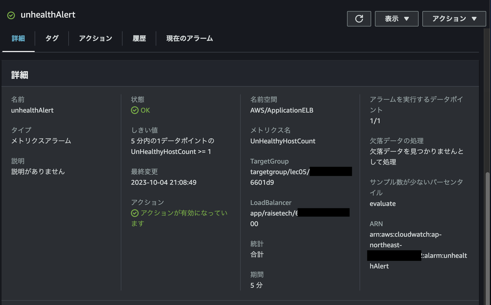
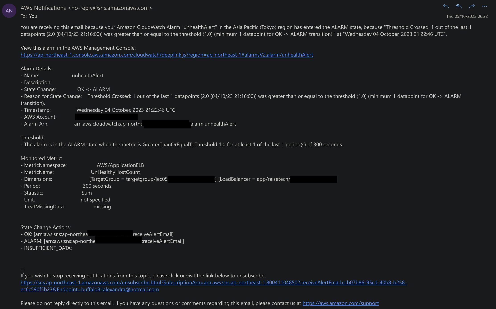

# 6回課題

#### あなたが最後にAWSを利用した日の記録を、どれでもよいのでCloudTrailのイベントから探し出してください  

ご自身の IAM ユーザー名があるもので OK です。見つけたイベントの中にはどんな情報が含まれていますか。  イベント名と、含まれている内容3つをピックアップしてください。  

イベント名：PutBucketPublicAccessBlock  
含まれている内容:

- "eventTime": "2023-09-21T16:32:53Z",
- "responseElements": null,  
- "eventID": "27eb82de-3075-4430-b0cb-1888512dde6c",  

---

#### アラームの設定  

今日学んだ CloudWatch アラームを使って、ALB のアラームを設定して、メール通知してみてくだ
さい。  
メールには Amazon SNS を使います。デモンストレーションでは設定していませんが、OK アク
ションも今回は設定してください。  
設定すべき内容のヒントは今日の資料にあります。よくあるアラーム設定なので、ネット上で調べても見つかります。  
アラームとアクションを設定した状態で、Rails アプリケーションが使える、使えない状態に
して、動作を確認してみてください。どうなりますか？

- 設定内容  
  - 対象およびメトリクス：ALB/ UnhealtyHostCount  
  - 閾値およびアクション：300 秒あたりに 1 以上/E メール通知（Amazon SNS を利用）  
※OKアクション追加（Unhealthからhealthに戻ったら通知）  

アラーム設定画面

railsアプリを止めて5分後、Unhealthyとなり、通知メールが来た  

railsアプリを起動して5分後、OKアクションの通知メール  
  

---

#### 見積もり  
AWS 利用料の見積を作成してください。  
今日までに作成したリソースの内容を見積もってください。  
できたものは URL を共有してください。  

- URL  
  [aws pricing calculator](https://calculator.aws/#/estimate?id=54ac4dd7aa268ded263dd0ba15d64081edb02dad)  

- 見積もり内容

  - EC2
  - VPC
  - RDS
  - ELB
  - AWS CloudTrail
  - amazon CloudWatch

---
マネジメントコンソールから、現在の利用料を確認して教えてください。  
先月の請求情報から、EC2 の料金がいくらか確認してください。  
無料利用枠で収まっていますか？ free tier が無料を意味します。

- 現在の利用料：0ドル

- 先月のEC2の料金：0ドル  
  647.808 Hrs　なので無料枠(750h)に収まっている

[AWS　無料利用枠](https://aws.amazon.com/jp/free/?all-free-tier.sort-by=item.additionalFields.SortRank&all-free-tier.sort-order=asc&awsf.Free%20Tier%20Types=*all&awsf.Free%20Tier%20Categories=*all)