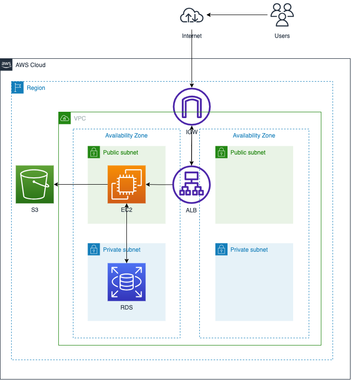

# 第10回課題  

### CloudFormation を利用して、現在までに作った環境をコード化しましょう。コード化ができたら実行してみて、環境が自動で作られることを確認してください

- 作成した環境の構成図は以下の通り

#### EC２インスタンス作成

#### EC2にSSH接続

#### RDS作成

#### EC2からRDSへの接続

#### 課題を取り組むにあたりしたこと、感想

- VScodeの拡張（CloudFormation,CloudFormationLint）を使って効率的にタイピング
- エラーが出たら翻訳・仮説、chatGPTで解析後、リファレンス読んで、修正（これを繰り返す）
- chatGPTは具体的な数字（バージョンなど）が古い情報の場合があるのでリファレンスを読むのは必須
- git操作を誤ってしまい、gitへのアクセスができなくなる。SSHキーを登録するところからやり直した。勉強にはなったが実務ではもっと注意深く作業すべき教訓になった。
- 滞っていた学習を取り戻そうとするあまり、課題を早く提出することに重きにおいてしまい、課題の本来の目的を見失いかけた。
- 「コンソールで作成した環境をコード化する」という目的から逸脱しかけたので、急がず丁寧に取り組むべき、と改めて思った。
