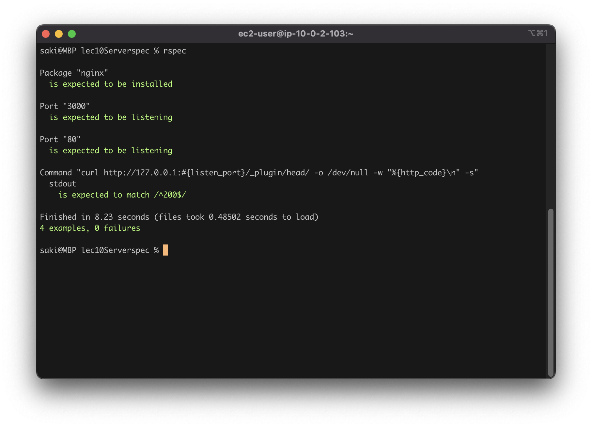

# 第11回課題

## Serverspecでテストコードを作成して、テストを成功させる（テスト定義は自由）

Severspecとは：  
- サーバー構成の確認をコードにより自動化できるツール　
- RSpecというrubyで作られたテスティングフレームワークの機能を活用して作られている
---
### EC2にあるアプリをSSH経由でテストする
前提  
SSH接続可能なEC2がある  
EC2にrubyアプリがある
1. serverspecをローカルにインストール  
    `gem install serverspec`

2. セットアップ  
    `serverspec-init`

```bash
Select OS type:  #OSを選択 →　macなので1

  1) UN*X
  2) Windows

Select number: 1

Select a backend type:　# 接続タイプを選択 →　1

  1) SSH
  2) Exec (local)

Select number: 1

Vagrant instance y/n: n  #個人作業なのでn
Input target host name:  #EC２なのでパブリックIPアドレスまたは完全修飾ドメイン名（FQDN）→　記載は省略
```

3. 作成されるディレクトリ内にある`sample_spec.rb`　を置換(講義内で案内された同名のrubyコード)
4. .ssh フォルダ内に configファイルを作成  
   ```
   Host <IPアドレス>
    HostName <パブリックDNS>
    User ec2-user
    IdentityFile <キーペアの場所>
5. ターゲットホストの設定
   `export TARGET_HOST=<IPアドレス>
`
6. テストを実行  
    `rspec`

---
#### テストの内容  
```
listen_port = 3000

# nginxがインストールされているか
describe package('nginx') do
  it { should be_installed }
end

#指定のポート（この場合は3000）がListenしているか 
describe port(listen_port) do
  it { should be_listening }
end

# 指定のポート80がListenしているか
describe port("80") do
  it { should be_listening }
end

# curlでHTTPアクセスして200 OKが返ってくるか
describe command('curl http://127.0.0.1:#{listen_port}/_plugin/head/ -o /dev/null -w "%{http_code}\n" -s') do
  its(:stdout) { should match /^200$/ }
end
```
---
課題エビデンス

  