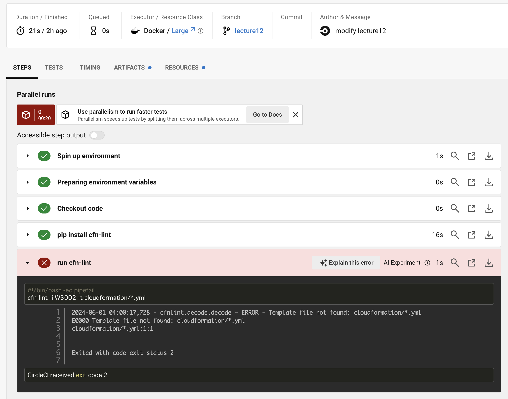
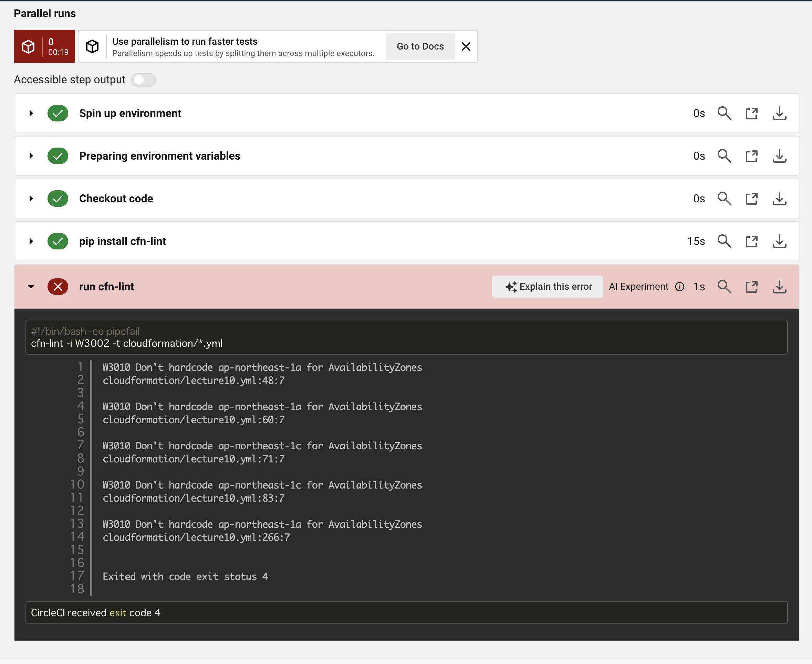
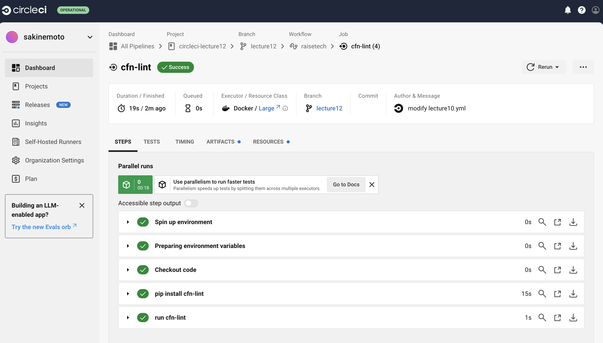

# 第12回課題  

## 提供されたCircleCIコンフィグを課題リポジトリに組み込んで、正しく動作するか確認する  

### 手順

1. CircleCIのアカウント作成  
1. organization の作成（個人学習の設定）  
1. プロジェクトの作成
1. サンプルコンフィグを追加してプッシュ  

→エラー  

- .circleci/config.ymlをデフォルトで読み込むように設定を変更  
  - Project Setting > Advanced Settings　で'Enable dynamic config using setup workflows'を無効化する  

→再プッシュ〜エラー  
  

- cloudformationフォルダ内のymlファイルがないエラー  
  - cloudformationフォルダを作成して第10回課題のymlファイルをフォルダ内に移動させる  

→再プッシュ〜エラー  
  

- 第10回課題のymlファイルにアベイラビリティゾーンのハードコードのエラー  
  - アベイラビリティゾーンを自動取得するように修正  

→再プッシュ〜成功  
  

---

#### 感想　　

- CircleCIのアカウント登録後、よくわからずgitHubの連携を外したらログインできなくなってしまった。  
- サポートに連絡したものの数日経っても解決しなかったため、別アドレスでアカウント作成し直した。  
- 最初は仕組みがよくわからなかったものの、２度目のプッシュで仕組みを理解。  
- 確かにこの自動化はとても便利だと感じた。
