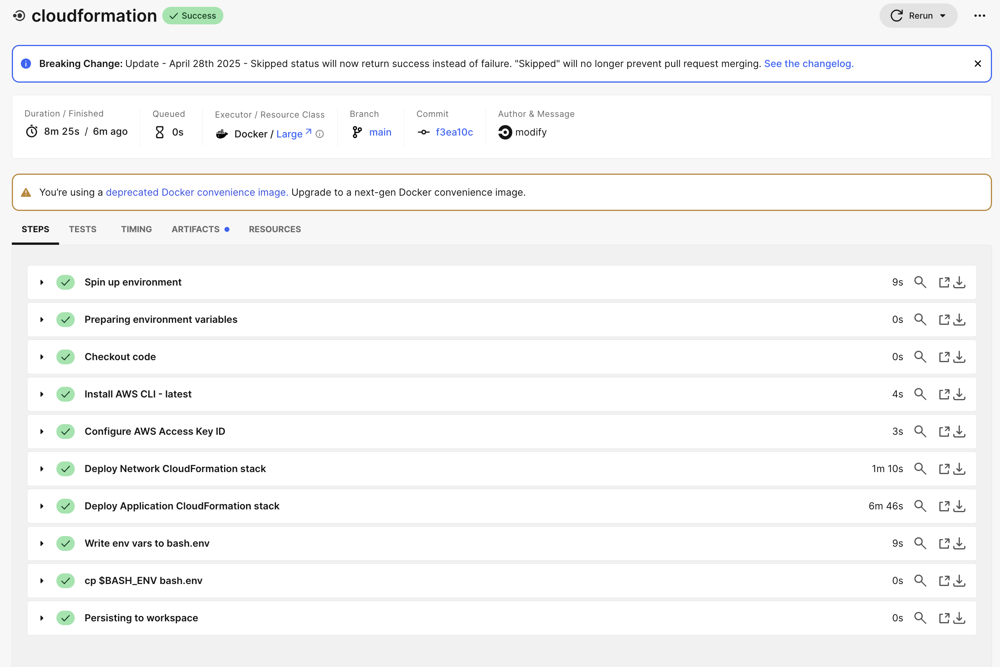
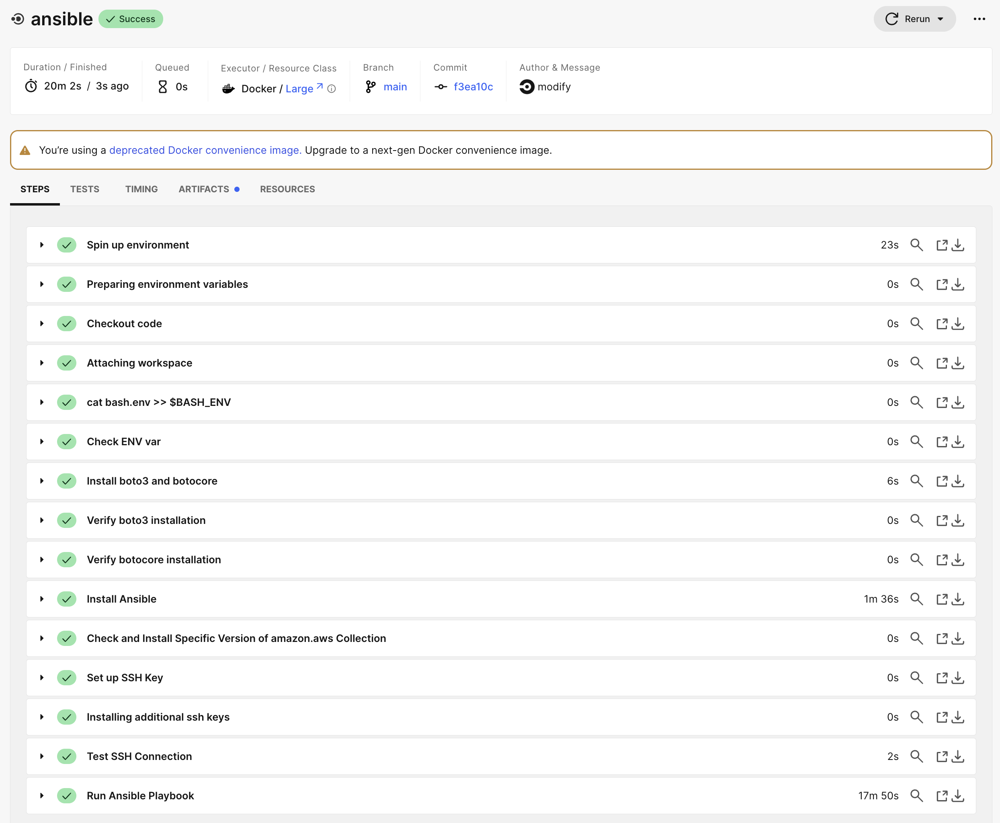
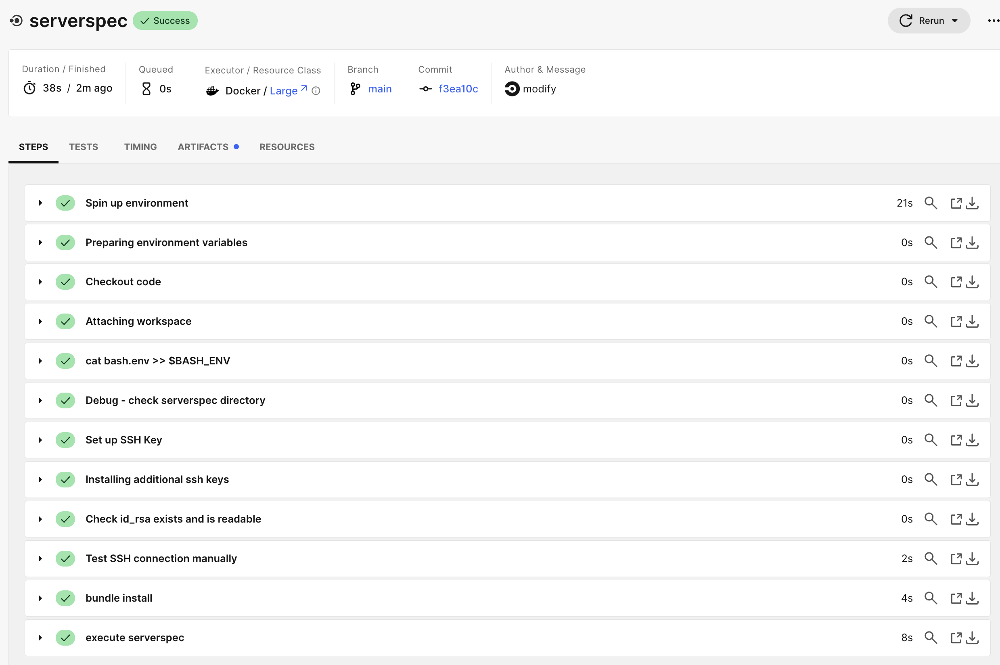
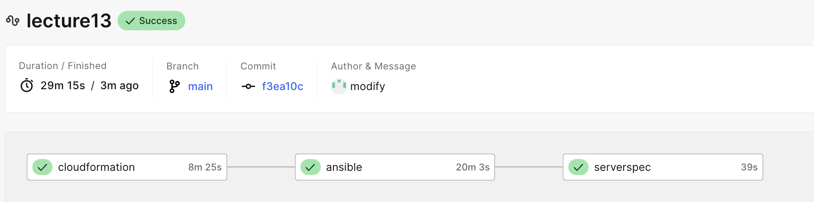
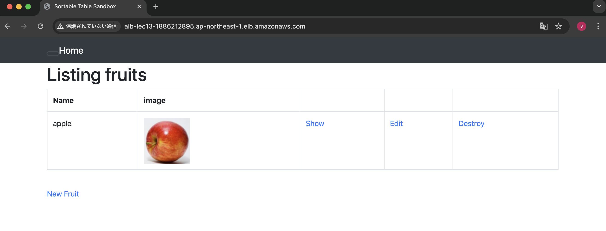

# 第13回課題  

## 課題内容

CircleCI のサンプルに ServerSpec や Ansible の処理を追加  

【事前設定】  
CircleCIにcloudformation・ansible・serverspecの設定を追加  
  
- CirclecCI環境変数を設定
  - プロジェクト設定の「Environment Variables」を追加
    - AWS_ACCESS_KEY_ID
    - AWS_SECRET_ACCESS_KEY
    - AWS_DEFAULT_REGION
    - DB_PASSWORD
    - ENVIRONMENT_NAME
    - PRIVATE_KEY
  
---

### 各リソース

#### CircleCI

CloudFormationのテンプレートを使ってスタックを作成  

- CircleCIのconfig.ymlにCloudFormationのテンプレートを実行する処理を追加
- 実行結果  
  

#### Ansible

- CircleCIのconfig.ymlにAnsibleのplaybookを実行する処理を追加  
- 実行結果  

#### Serverspec

- CircleCIのconfig.ymlにSeverspecのテスト実行する処理を追加  
- 実行結果  
  

---

CircleCI実行結果  

#### ALBのDNS名でアクセス、アプリが動作することを確認

